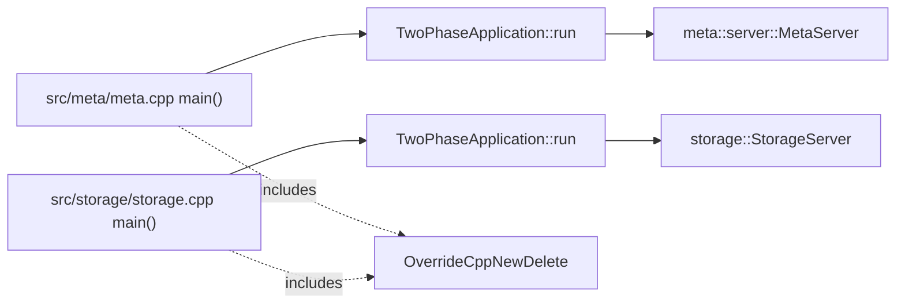

# 3FS Component Deep-Dive Example: meta and storage service entrypoints

这个文件是 `storage-project-investigator` 的输出形态示例，不是 3FS 的完整结论。真实调研必须在本地目标仓库重新读取源码，补齐精确行号、服务类定义、请求 handler、配置和调用链。

示例来源：公开仓库 `deepseek-ai/3FS` 的 `src/meta/meta.cpp` 与 `src/storage/storage.cpp`。这里只保留很短的源码片段，用来展示“详查”应该如何从具体代码对象开始。

## Role and Boundary

从入口文件可以确认 3FS 至少有独立的 metadata service 进程入口和 storage service 进程入口：

- `src/meta/meta.cpp`：构造并运行 `meta::server::MetaServer`。
- `src/storage/storage.cpp`：构造并运行 `storage::StorageServer`。
- 两者都通过 `common/app/TwoPhaseApplication.h` 包装启动生命周期。
- 两者都包含 `memory/common/OverrideCppNewDelete.h`，说明进程级内存分配覆盖是全局行为，需要在 memory 组件中单独详查。

这已经能支撑一个组件边界判断：`meta` 和 `storage` 不是单纯目录分组，而是两个可独立启动的服务边界；`TwoPhaseApplication` 是跨服务共享的应用生命周期框架。

## Code Walkthrough

### Metadata service process entry

```cpp
#include "common/app/TwoPhaseApplication.h"
#include "memory/common/OverrideCppNewDelete.h"
#include "meta/service/MetaServer.h"

int main(int argc, char *argv[]) {
  using namespace hf3fs;
  return TwoPhaseApplication<meta::server::MetaServer>().run(argc, argv);
}
```

分析：

- `main()` 没有直接解析配置或启动线程，而是把全部进程生命周期交给 `TwoPhaseApplication<T>::run(argc, argv)`。
- 模板参数 `meta::server::MetaServer` 是 metadata service 的服务主体。下一步必须打开 `src/meta/service/MetaServer.h` 和对应 `.cc/.cpp`，追 `MetaServer` 的构造、初始化、start/stop、RPC 注册、后台任务和 store 依赖。
- `OverrideCppNewDelete.h` 在入口处被包含，说明内存分配行为可能在进入服务主体前已经被覆盖。任何 memory/cost/allocator 指标都不能只看业务代码。

### Storage service process entry

```cpp
#include "common/app/TwoPhaseApplication.h"
#include "memory/common/OverrideCppNewDelete.h"
#include "storage/service/StorageServer.h"

int main(int argc, char *argv[]) {
  using namespace hf3fs;
  return TwoPhaseApplication<storage::StorageServer>().run(argc, argv);
}
```

分析：

- `storage::StorageServer` 是 storage service 的服务主体。下一步必须追 `src/storage/service/StorageServer.h`、实现文件、`src/storage/worker/`、`src/storage/store/`、`src/storage/chunk_engine/`、`src/storage/aio/`。
- `meta` 与 `storage` 使用同一个 `TwoPhaseApplication` 框架，说明配置解析、日志、signal、生命周期阶段、进程退出语义可能是共享逻辑。不能分别孤立分析两个服务的启动/停止行为。
- 入口代码本身不能证明 read/write path、durability、placement 或 backpressure；它只证明服务边界和生命周期框架入口。

## State and Data Flow

从入口文件只能得到低置信结论：

- metadata state 的权威位置不能由 `meta.cpp` 判断，必须继续追 `MetaServer` 到 store/fdb/kv 相关代码。
- storage state 的权威位置不能由 `storage.cpp` 判断，必须继续追 `StorageServer` 到 chunk、store、AIO、device path。
- `TwoPhaseApplication` 可能拥有全局配置、日志、生命周期状态；需要打开其定义验证。

正确写法不是把这些当成已确认事实，而是把它们写入 next probes。

## Cross-Component Interactions

这个层级已经暴露出一条应当继续追踪的跨组件链：



边解释：

- `main() -> TwoPhaseApplication<...>::run` 是同步函数调用，代码入口直接可见。
- `TwoPhaseApplication -> *Server` 是模板实例化产生的生命周期绑定，需要继续读 `TwoPhaseApplication` 源码确认构造、初始化和错误传播。
- `main() -. includes .-> OverrideCppNewDelete` 是编译期包含关系，不等同于运行期调用；需要追头文件定义确认是否通过全局 `operator new/delete` 生效。

## Project Document Analysis

项目文档若声称 3FS 是 disaggregated / metadata-service / storage-service 架构，这两个入口文件可作为进程边界的代码支撑。但文档中的性能、强一致性或持久化语义不能由入口文件证明，需要继续追具体 request path、store transaction 和 storage write path。

## Open Questions

- `TwoPhaseApplication` 的两个 phase 是什么，失败时如何 unwind？
- `MetaServer` 是否注册 RPC service，是否依赖 FoundationDB 或其他 KV store？
- `StorageServer` 如何初始化 worker、chunk engine、AIO 和 device state？
- `OverrideCppNewDelete` 是否影响所有服务，是否有统计、limit 或 failure behavior？
- metadata 和 storage 服务之间是否直接 RPC，还是由 client 协调？

