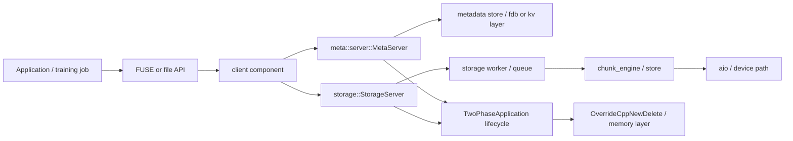

# 3FS Cross-Component Interaction Example

这个文件示范 `04-cross-component-interactions.md` 或组件文档里的跨组件分析应该怎么写。图是调查假设图，必须用目标仓库源码逐边验证；不能把图本身当成事实。

## Interaction Under Investigation

问题：一个 file read/write 请求在 3FS 中是否经过 FUSE/client、metadata service、storage service、chunk engine/AIO，以及共享生命周期/内存组件？

已确认的代码锚点：

- `src/meta/meta.cpp` 通过 `TwoPhaseApplication<meta::server::MetaServer>().run(argc, argv)` 启动 metadata service。
- `src/storage/storage.cpp` 通过 `TwoPhaseApplication<storage::StorageServer>().run(argc, argv)` 启动 storage service。
- 两个入口都包含 `memory/common/OverrideCppNewDelete.h`。

待验证的代码锚点：

- `src/fuse/` 或 `hf3fs_fuse/`：用户态文件接口入口。
- `src/client/`：client request assembly、RPC、retry、completion。
- `src/meta/service/`：metadata RPC handler、namespace/layout 查询。
- `src/storage/service/`：storage RPC handler。
- `src/storage/chunk_engine/`、`src/storage/store/`、`src/storage/aio/`：chunk 到设备 I/O 的路径。
- `src/fdb/` 或 `src/kv/`：metadata 权威状态和事务边界。

## Mermaid Map

## Edge Review

| Edge | Meaning | Required code proof | Current status |
| --- | --- | --- | --- |
| `App -> Fuse` | workload enters file interface | FUSE init, mount, operation table, read/write callbacks | 待读 |
| `Fuse -> Client` | FUSE operation delegates to client library | callback body and client method call | 待读 |
| `Client -> MetaSvc` | metadata lookup, layout, namespace mutation | RPC stub, request type, retry/timeout | 待读 |
| `MetaSvc -> MetaStore` | metadata authoritative state update/read | transaction wrapper, key schema, error handling | 待读 |
| `Client -> StorageSvc` | data-plane RPC or chunk operation | RPC stub, chunk ID, placement mapping | 待读 |
| `StorageSvc -> Worker` | request leaves RPC thread and enters worker/queue | enqueue path, queue bound, cancellation | 待读 |
| `Worker -> Chunk -> AIO` | chunk operation reaches device async I/O | chunk layout, write/read method, completion path | 待读 |
| `*Svc -> AppFrame` | process lifecycle is shared | `TwoPhaseApplication` source and service interface methods | 部分确认 |
| `AppFrame -> Alloc` | global memory override may affect services | `OverrideCppNewDelete.h` implementation | 待读 |

## How To Write The Analysis

每条边必须落到代码对象：

- 如果是函数调用：写 `caller -> callee`、参数、返回值和错误传播。
- 如果是 RPC：写 stub/server handler、request/response 类型、timeout、retry、idempotency。
- 如果是队列：写 enqueue/dequeue、容量、调度线程、backpressure、drop/cancel。
- 如果是持久化：写 write/flush/fsync/transaction/commit/apply 的具体边界。
- 如果是配置依赖：写配置 key、默认值、在哪里读取、如何影响路径。

不能只写“client 访问 metadata 再访问 storage”。那是架构概括，不是跨组件详查。

## Cannot Claim Yet

- 不能声称 metadata 强一致，除非追到事务、冲突处理和读写隔离逻辑。
- 不能声称 write ack 代表 durable，除非追到 storage write、flush、replication/EC ack 和 completion 返回。
- 不能声称 performance bottleneck 在 AIO 或 network，除非代码路径和 profile/trace 共同支持。

